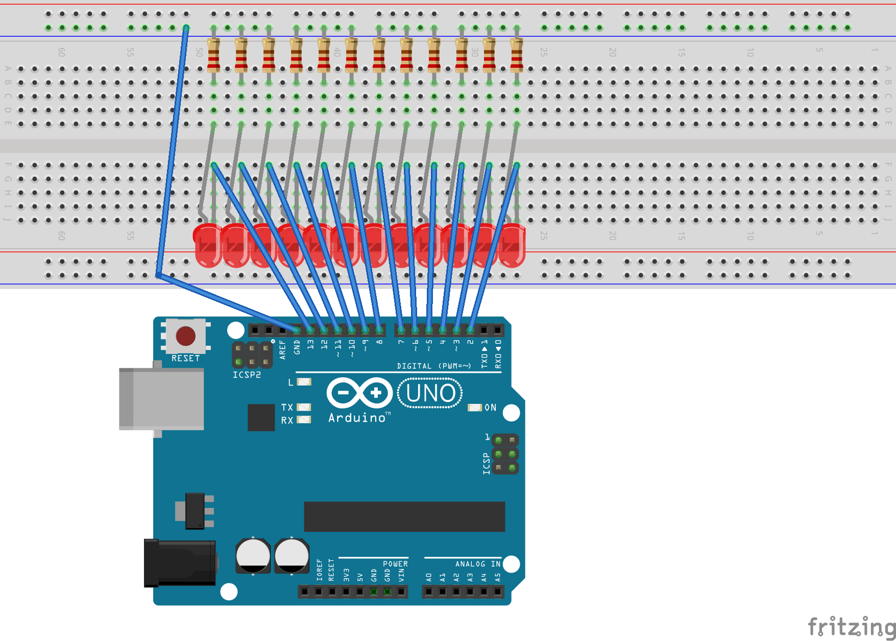

# Arduino 12-LED Light Chaser

A mesmerizing LED light chaser project using Arduino Uno that creates beautiful sequential lighting patterns with 12 LEDs.



## Overview

This project implements a versatile light chaser circuit that cycles through 7 different mesmerizing lighting patterns. Perfect for mood lighting, decorations, learning Arduino programming, or as a starting point for more complex lighting projects.

## Features

- **7 Different Light Patterns**:
  - Basic sequential chase
  - Bounce pattern (back-and-forth)
  - Multi-LED chasing effect
  - Random flickering
  - Fade in/out transitions (on PWM pins)
  - Converge/diverge patterns
  - Synchronized on/off effect
  
- **Easily Customizable**:
  - Adjustable speed control
  - Modifiable pattern sequence
  - Simple code structure for adding new patterns

## Hardware Requirements

- Arduino Uno
- 12 LEDs (any color or combination)
- 12 resistors (220Ω-330Ω depending on LED color)
- Breadboard
- Jumper wires
- USB cable (for Arduino programming)
- Power source (USB or battery pack)

## Circuit Diagram

The circuit connects 12 LEDs to digital pins 2-13 on the Arduino Uno. Each LED needs a current-limiting resistor.

```
Arduino Pin (2-13) → 220Ω Resistor → LED → GND
```


## Installation

1. **Clone this repository**:
   ```
   git clone https://github.com/yourusername/arduino-led-chaser.git
   ```

2. **Build the circuit** according to the diagram above.

3. **Open the Arduino IDE** and load the `led_chaser.ino` file.

4. **Connect your Arduino** to your computer via USB.

5. **Upload the sketch** to your Arduino board.

## Usage

Once the code is uploaded, the Arduino will automatically cycle through all seven lighting patterns. 

### Customizing Speed

Adjust the `delayTime` variable in the code to change the speed of the patterns:
```cpp
int delayTime = 100;  // Default delay time in milliseconds (lower = faster)
```

### Selecting Specific Patterns

To run only specific patterns, modify the `loop()` function by commenting out the patterns you don't want:

```cpp
void loop() {
  basicChase();            // Simple chase pattern
  bouncePattern();         // Bounce back and forth
  // multiLedChase(3);     // Commented out - won't run
  randomFlicker(30);       // Random LED flickering
  // fadeInOutPattern();   // Commented out - won't run
  convergeDiverge();       // Converging and diverging pattern
  allOnAllOff(3);          // All LEDs on then off
}
```

## Creative Ideas

- **LED Arrangement**: Try arranging LEDs in a circle, spiral, or other patterns instead of a straight line
- **Mix Different Colors**: Use various colored LEDs for more visual interest
- **Add a Potentiometer**: Connect a potentiometer to analog pin A0 to control speed in real-time
- **Enclosure Design**: Place the circuit in a translucent enclosure for diffused lighting effects
- **Sound Reactivity**: Add a microphone module to make the lights react to sound (requires code modification)

## Troubleshooting

- **LEDs Not Lighting**: Check LED polarity (long leg should connect to resistor)
- **Dim LEDs**: Verify resistor values aren't too high
- **Irregular Patterns**: Ensure all connections are secure and code is uploaded correctly
- **Not All LEDs Work**: Double-check pin connections and make sure each pin is set as OUTPUT in the code

## Circuit Layout Tips

For the most visually appealing results:

1. **Consistent Spacing**: Keep LEDs evenly spaced
2. **Symmetrical Arrangement**: Consider circular or symmetrical patterns
3. **Clean Wiring**: Keep wires organized for better aesthetics and easier troubleshooting
4. **Diffusion**: Add a light diffuser (like frosted acrylic) for softer light effects

## Contributing

Contributions are welcome! Please feel free to submit a Pull Request.

1. Fork the repository
2. Create your feature branch (`git checkout -b feature/amazing-feature`)
3. Commit your changes (`git commit -m 'Add some amazing feature'`)
4. Push to the branch (`git push origin feature/amazing-feature`)
5. Open a Pull Request

## License

This project is licensed under the MIT License - see the [LICENSE](LICENSE) file for details.

## Acknowledgments

- Inspired by classic LED chaser circuits
- Thanks to the Arduino community for their continuous support and inspiration

## Project Status

Active and maintained. Future enhancements may include:
- Additional lighting patterns
- Support for addressable RGB LEDs
- Mobile app control capabilities
- PCB design for permanent installation

---
